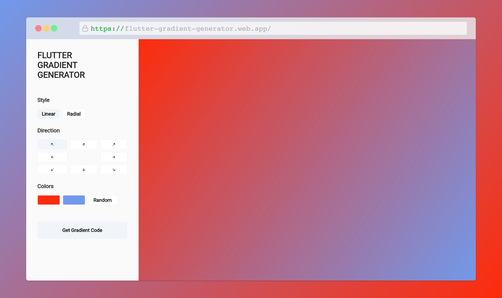

# Flutter Gradient Generator
Flutter Gradient Generator is a web app that generates linear and radial gradients for Flutter widgets.

## Usage

1. Visit [the web app](https://flutter-gradient-generator.web.app/).

2. Choose the gradient style. The options are:
   - linear
   - radial.

3. Choose the gradient direction. The options are:
   - top-left
   - top-center
   - top-right
   - center-left
   - center (only works for radial gradients)
   - center-right
   - bottom-left
   - bottom-center
   - bottom-right

4. Choose the gradient colors. You can either 
   - use the color pickers to select your colors or,
   - use random colors by clicking the random button

5. Click on "Get Gradient Code" and the code will be copied to your clipboard.

## Roadmap

- [x] Linear gradient
- [x] Radial gradient
- [x] Color picker
- [ ] Dark mode

## Contact

Victor Eronmosele - victoreronmosele@gmail.com

Project Link: [https://github.com/victoreronmosele/flutter_gradient_generator](https://github.com/victoreronmosele/flutter_gradient_generator)

## Acknowledgments

* [CSS Gradient Generator](https://www.css-gradient.com/) for the visual design inspiration.
* [Cyclop](https://github.com/rxlabz/cyclop) for the color picker

## License
Distributed under the GPL 3.0 License. See [LICENSE.txt](LICENSE.txt) for more information.

